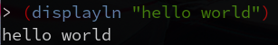

实验课程名称：<ins>$course_name</ins>

<!-- width 15.6-->
<table width="100%">
    <tr>
    <td width="16%" text-align="center"><b>实验项目名称</td>
    <td colspan="3">$lab_name</td>
    <td width="16%" text-align="center"><b>实验成绩</td>
    <td></td>
    </tr>
    <tr>
    <td text-align="center"><b>实 验 者</td>
    <td width="14%">$name</td>
    <td width="14%" text-align="center"><b>专业班级</td>
    <td width="18%">$class</td>
    <td text-align="center"><b>组    别</td>
    <td></td>
    </tr>
    <tr>
    <td text-align="center"><b>同 组 者</td>
    <td colspan="3"></td>
    <td text-align="center"><b>实验日期</td>
    <td></td>
    </tr>
</table>

第一部分 实验预习报告（包括实验目的、意义，实验基本原理与方法，主要仪器设备及耗材，实验方案与技术路线等）

### 实验目的

### 实验内容

### 实验原理

第二部分 实验过程记录（可加页）（包括实验原始数据记录，实验现象记录，实验过程发现的问题等）

### 源代码

### 运行结果

教师签字________

第三部分 结果与讨论（可加页）

实验结果分析（包括数据处理、实验现象分析、影响因素讨论、综合分析和结论等）

### 结果分析

### 小结

### 思考题

